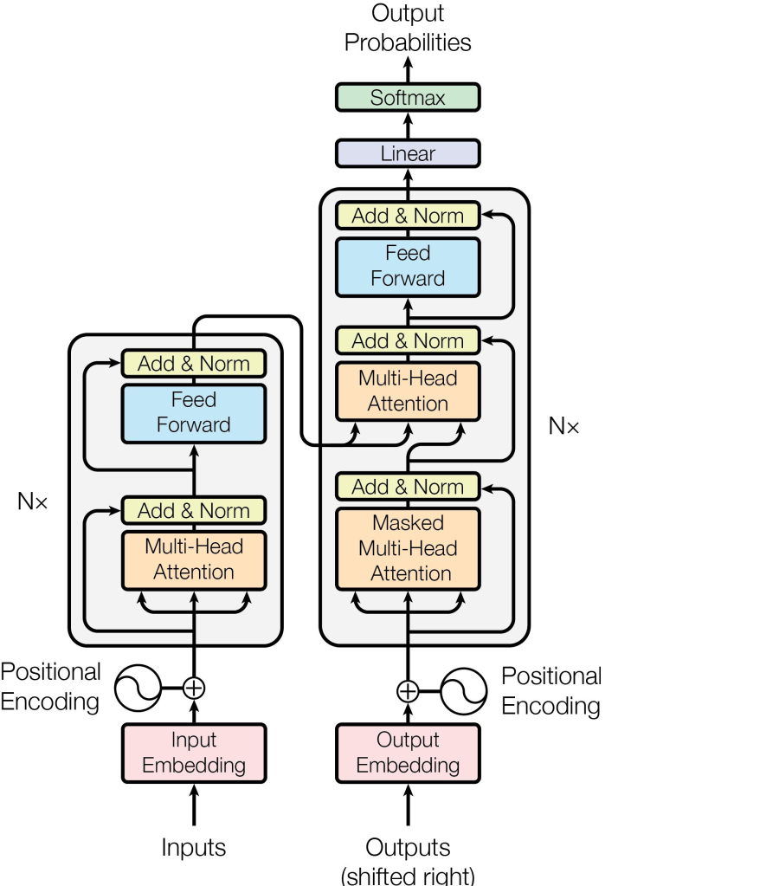

# Transformer

Кастомная реализация Transformer (Encoder–Decoder) на PyTorch.



Особенности

- Encoder–Decoder архитектура

- Одинаковый `vocab size` и `embedding size` для encoder и decoder

- Sinusoidal positional encoding

- Без Dropout (для простоты)

- Выход модели — logits (без Softmax)

------

Реализованы тесты на проверку размерностей в трансформере.

1. Установить зависимости:

```
pip install torch pytest
```

2. Пройти тесты:
```
pytest -v
```
---------

Реализовано по мотивам туториала:
https://habr.com/ru/articles/891972/